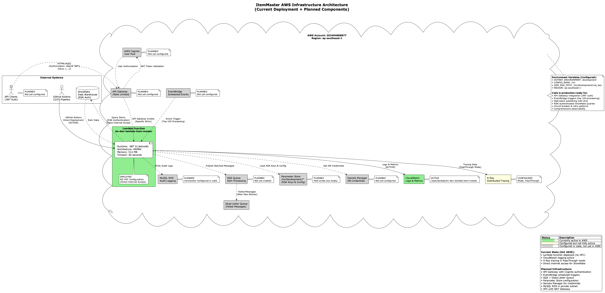

# ItemMaster

A serverless .NET 8 application built using Clean Architecture principles, designed to process SKU (Stock Keeping Unit)
data through AWS Lambda. The solution integrates with Snowflake for data retrieval and AWS SQS for message publishing.

## Table of Contents

- [Architecture Overview](#architecture-overview)
- [Key Features](#key-features)
- [Project Structure](#project-structure)
- [AWS Infrastructure](#aws-infrastructure)
- [Data Flow & Processing](#data-flow--processing)
- [Error Handling & Resilience](#error-handling--resilience)
- [Lambda Initialization](#lambda-initialization)
- [AWS Configuration Settings](#aws-configuration-settings)
- [Getting Started](#getting-started)
- [Running & Testing](#running--testing)
- [Deployment](#deployment)
- [Credentials & Access](#credentials--access)

---

## Architecture Overview

### Clean Architecture Layers


The ItemMaster solution follows Clean Architecture with clear separation of concerns across multiple layers:

```
ItemMaster.Lambda/
├── src/
│   ├── ItemMaster.Lambda/           # AWS Lambda entry point
│   ├── ItemMaster.Application/      # Application/Use Case layer
│   ├── ItemMaster.Domain/           # Domain entities
│   ├── ItemMaster.Infrastructure/   # External integrations
│   ├── ItemMaster.Shared/          # Cross-cutting concerns
│   └── ItemMaster.Contracts/       # DTOs and contracts
└── test/
    ├── ItemMaster.Lambda.Tests/     # Lambda layer unit tests
    ├── ItemMaster.Application.Tests/ # Application layer unit tests
    ├── ItemMaster.Infrastructure.Tests/ # Infrastructure layer unit tests
    └── ItemMaster.Integration.Tests/ # End-to-end integration tests
```

**Design Principles:**

- **Dependency Inversion**: Higher-level layers depend only on abstractions
- **Single Responsibility**: Each layer has a clear, focused purpose
- **Separation of Concerns**: Business logic isolated from infrastructure
- **Testability**: In-memory implementations for all external dependencies

### Layer Descriptions

#### 1. Domain Layer (`ItemMaster.Domain`)

- Core business entities (`Item`)
- No dependencies on other layers
- Pure C# objects (POCOs)

#### 2. Application Layer (`ItemMaster.Application`)

- Use cases (`ProcessSkusUseCase`)
- Business workflows and orchestration
- Depends only on Domain and abstractions

#### 3. Infrastructure Layer (`ItemMaster.Infrastructure`)

- External service implementations:
    - `SnowflakeRepository` - RSA-authenticated data access
    - `SqsItemPublisher` - Message publishing with circuit breaker
    - `MySqlItemMasterLogRepository` - Source data audit logging to `item_master_source_log` table
- Resilience patterns (Polly)
- EF Core configurations

#### 4. Lambda Layer (`ItemMaster.Lambda`)

- AWS Lambda handler
- Request source detection (API Gateway, EventBridge, Direct)
- Dependency injection container setup
- Configuration loading (appsettings, environment variables, Parameter Store)

#### 5. Shared Layer (`ItemMaster.Shared`)

- Common abstractions and interfaces
- Result pattern implementation
- Clock abstraction for testability

---

## Key Features

- **Clean Architecture**: Clear separation of concerns with dependency inversion
- **Serverless**: AWS Lambda with .NET 8 runtime and ARM64 architecture
- **Multi-Source Requests**: Supports API Gateway (authenticated) and EventBridge triggers
- **RSA Key-Pair Authentication**: Secure Snowflake connection without passwords
- **Resilience Patterns**: Circuit breaker, retry policies, and partial batch retry logic
- **Observability**: Comprehensive logging (Serilog), CloudWatch metrics, and X-Ray distributed tracing (disable for
  cost savings)
- **Configuration Management**: Multi-source configuration (appsettings, environment variables, Parameter Store)
- **Security**: AWS Cognito JWT authentication, IAM roles, encrypted secrets (KMS)
- **CI/CD**: GitHub Actions automated deployment pipeline
- **Partial Batch Retry**: Only retries failed messages, not entire batches

---

## AWS Infrastructure

### System Architecture



The complete AWS infrastructure includes:

- **API Gateway**: REST API with Cognito JWT authentication, rate limiting (1 req/sec, 1 burst)
- **AWS Cognito**: User Pool for authentication (Access token: 1hr, Refresh token: 1 day)
- **EventBridge**: Scheduled rules for batch processing (daily at 2:00 AM UTC)
- **Lambda Function**: Serverless compute with ARM64, .NET 8, 512MB, 60s timeout, No VPC (NAT cost savings)
- **IAM Roles**: Least privilege access for Lambda and other services
- **SQS Queue**: Main queue with 4-day retention, 60s visibility timeout, 10 max receive count
- **Dead Letter Queue (DLQ)**: Captures failed messages after 10 attempts
- **Snowflake Integration**: RSA key-pair authentication (no password required)
- **Parameter Store**: Encrypted application configuration
- **Secrets Manager**: Secrets (RSA private key for Snowflake, DB credentials) with automatic rotation where applicable
- **CloudWatch**: Logs (7-day retention) and custom metrics
- **X-Ray**: Distributed tracing (PassThrough mode)
- **RDS MySQL**: Audit trail database (db.t4g.micro ARM-based)

### Infrastructure Configuration Details


**All infrastructure components are fully deployed and operational.**

---

## Data Flow & Processing

### Processing Workflow


The data flow demonstrates three request sources:

#### 1. API Gateway Path (Authenticated)

- Client sends POST request to `/process-skus` with JWT token
- API Gateway validates token with Cognito User Pool
- Rate limiting applied (1 req/sec)
- SKUs extracted from request body
- Lambda processes and returns response

#### 2. EventBridge Path (Scheduled/Event-Driven)

- EventBridge triggers Lambda on schedule (daily at 2:00 AM UTC)
- Lambda detects EventBridge source via header
- Automatically retrieves top 100 items from Snowflake
- Processes without specific SKU input

#### 3. Direct Lambda Invocation (Current Testing Method)

- Direct invocation for testing and development
- Bypasses API Gateway authentication
- Useful for CI/CD health checks

### SKU Processing Workflow


**Complete processing flow:**

1. **Request Source Detection**: `RequestSourceDetector` identifies trigger source
2. **Health Check Short-Circuit**: Empty/`{}` payload from CI/CD path returns 200 without processing
3. **Observability Wrappers**: All major operations run under `ObservabilityService` for metrics + tracing
4. **Snowflake Query**: RSA-authenticated data retrieval
5. **Validation & Mapping**: Domain `Item` → `UnifiedItemMaster`, skipping invalid items with detailed reasons
6. **SQS Publishing**: One message per unified item; batches of 10; partial batch retry
7. **Circuit Breaker**: Protect against cascading failures (open ~30s) on repeated errors
8. **DLQ Redrive**: SQS DLQ after 10 receives
9. **Audit Logging**: MySQL database logs all operations

**Key Feature - Partial Batch Retry:**

- If 7 out of 10 messages succeed, only 3 failed messages are retried
- Successful messages logged immediately and never retried
- Exponential backoff: 1s → 2s → 4s
- After retries are exhausted, remaining failures are logged and surfaced

---

## Error Handling & Resilience


### Resilience Patterns Implemented

#### 1. Circuit Breaker (Polly)

- **Failure Threshold**: 50% failure ratio, min throughput configurable
- **Break Duration**: 30 seconds (configurable)
- **Sampling Duration**: 60 seconds (configurable)
- **Minimum Throughput**: 3 (configurable)
- **Behavior**: Fast-fail when circuit opens, prevents cascading failures

#### 2. Retry Policy

- **Max Retries**: Default 2 (configurable)
- **Base Delay**: Default 1000ms (configurable)
- **Backoff Multiplier**: 2.0x (configurable)
- **Pattern**: Exponential backoff (1s → 2s → 4s)
- **Scope**: Per-message retry, not per-batch

#### 3. Dead Letter Queue

- **Retention**: 4 days (345,600 seconds)
- **Max Receive Count**: 10 attempts (SQS-level)
- **Purpose**: Capture permanently failed messages
- **Monitoring**: CloudWatch alarms on DLQ message count

#### 4. Validation Failures

- Invalid items (missing SKU, invalid HTS, missing color/size, etc.) are skipped with a reason
- Skipped counts emitted via metric `ItemsSkippedValidation`

---

## Lambda Initialization


### Cold Start Process

The Lambda cold start initialization includes:

1. **AWS X-Ray Handler Registration**: PassThrough mode for distributed tracing
2. **Test Mode Check**: Environment variable `ITEMMASTER_TEST_MODE` for local testing
3. **Configuration Loading**:
    - appsettings.json (base configuration)
    - Environment variables (DOTNET_ENVIRONMENT, CONFIG_BASE, REGION)
    - Parameter Store (`{base}/{env}/`) for app configuration
4. **RSA Key Loading**: Snowflake private key from **Secrets Manager** secret referenced by `SSM_RSA_PATH`
5. **Service Container Setup**: Dependency injection with all services registered
6. **AWS Services Registration**: SQS, CloudWatch, Secrets Manager, X-Ray
7. **Database Configuration**: Entity Framework Core with MySQL
8. **Observability Setup**: Serilog structured logging, CloudWatch metrics

### Test Mode (In-Memory)

When `ITEMMASTER_TEST_MODE=true`:

- `InMemorySnowflakeRepository` (mock data)
- `InMemoryItemPublisher` (no SQS required)
- `InMemoryItemMasterLogRepository` (no MySQL required)
- EF Core in-memory database
- No AWS service dependencies

---

## AWS Configuration Settings

### Lambda Function Configuration

| Setting               | Value                                                            | Description                                   |
|-----------------------|------------------------------------------------------------------|-----------------------------------------------|
| **Function Name**     | `im-dev-lambda-item-master`                                      | Lambda function identifier                    |
| **Runtime**           | .NET 8 (dotnet8)                                                 | Latest .NET LTS release                       |
| **Architecture**      | ARM64                                                            | 20% cost savings vs x64                       |
| **Memory**            | 512 MB                                                           | Right-sized for workload                      |
| **Timeout**           | 60 seconds                                                       | Maximum execution time                        |
| **Handler**           | `ItemMaster.Lambda::ItemMaster.Lambda.Function::FunctionHandler` | Entry point                                   |
| **VPC**               | None                                                             | Direct internet access (no NAT Gateway costs) |
| **Ephemeral Storage** | 512 MB                                                           | Default Lambda storage                        |
| **X-Ray Tracing**     | PassThrough                                                      | Distributed tracing enabled                   |

### SQS Queue Configuration

#### Main Queue: `im-dev-itemmaster-queue`

| Setting                | Value                 | Description                   |
|------------------------|-----------------------|-------------------------------|
| **Message Retention**  | **4 days (345,600s)** | How long messages are kept    |
| **Visibility Timeout** | **60 seconds**        | Matches Lambda timeout        |
| **Max Receive Count**  | **10 attempts**       | After 10 failures → DLQ       |
| **Long Polling**       | **10 seconds**        | Reduces empty receive charges |
| **Encryption**         | SQS-Managed SSE       | Server-side encryption        |
| **Batch Size (Code)**  | 10 messages           | Messages per SendMessageBatch |

#### Dead Letter Queue: `im-dev-itemmaster-dlq`

| Setting                | Value                 | Description              |
|------------------------|-----------------------|--------------------------|
| **Message Retention**  | **4 days (345,600s)** | Failed message retention |
| **Visibility Timeout** | **30 seconds**        | Lower for inspection     |
| **Encryption**         | SQS-Managed SSE       | Server-side encryption   |

### CloudWatch Logs & Metrics

| Log Group                                      | Retention  | Description               |
|------------------------------------------------|------------|---------------------------|
| `/aws/lambda/im-dev-lambda-item-master`        | **7 days** | Main Lambda function logs |
| `/aws/lambda/im-dev-lambda-item-master-api-gw` | **3 days** | API Gateway Lambda logs   |

**Custom Metrics Emitted (actual):**

- `ProcessingSuccess` / `ProcessingFailure` (dimensions: Operation, RequestSource)
- `ProcessingDuration` (ms) (dimensions: Operation, RequestSource)
- `SnowflakeItemsFetched` (count)
- `LatestItemsFetched` (count)
- `ItemsPublishedToSqs` (count)
- `ItemsSkippedValidation` (count)

### AWS Cognito Configuration

| Token Type        | Expiration | Description               |
|-------------------|------------|---------------------------|
| **ID Token**      | **1 hour** | User identity information |
| **Access Token**  | **1 hour** | API Gateway authorization |
| **Refresh Token** | **1 day**  | Obtain new access tokens  |

**Security:**

- Token Type: RS256 (RSA Signature with SHA-256)
- Password Policy: Min 8 chars, complexity required
- MFA: Optional (TOTP)

### API Gateway Configuration

| Setting           | Value             | Description                    |
|-------------------|-------------------|--------------------------------|
| **Rate Limit**    | **1 req/sec**     | Maximum sustained request rate |
| **Burst Limit**   | **1 requests**    | Maximum concurrent requests    |
| **Authorization** | Cognito User Pool | JWT Bearer token               |

### Parameter Store Configuration

**Base Path**: `/im/development/`

#### Logging Configuration

- `log_level` (String) - Application log level (Debug, Information, Warning, Error)

#### MySQL Database Configuration

- `mysql/db` (String) - MySQL database name
- `mysql/host` (String) - MySQL host endpoint
- `mysql/port` (String) - MySQL port number (default: 3306)
- `mysql/secret_arn` (String) - ARN of the Secrets Manager secret containing MySQL credentials
- `mysql/ssl_mode` (String) - SSL mode for MySQL connection (Required, Preferred, None)

#### Snowflake Configuration

- `snowflake/account` (String) - Snowflake account identifier
- `snowflake/database` (String) - Snowflake database name
- `snowflake/role` (String) - Snowflake role for authentication
- `snowflake/schema` (String) - Snowflake schema name
- `snowflake/table` (String) - Snowflake table name
- `snowflake/user` (String) - Snowflake username
- `snowflake/warehouse` (String) - Snowflake warehouse name

#### SQS Configuration

- `sqs/url` (String) - SQS queue URL
- `sqs/max_retries` (String) - Maximum retry attempts (default: 2)
- `sqs/base_delay_ms` (String) - Base delay in milliseconds (default: 1000)
- `sqs/backoff_multiplier` (String) - Exponential backoff multiplier (default: 2.0)
- `sqs/batch_size` (String) - (present for compatibility; current publisher uses 10 per batch)

#### Circuit Breaker Configuration

- `sqs/circuit_breaker_failure_threshold` (String) - Number of failures before opening circuit (default: 5)
- `sqs/circuit_breaker_duration_of_break_seconds` (String) - Duration circuit stays open in seconds (default: 30)
- `sqs/circuit_breaker_sampling_duration_seconds` (String) - Sampling window duration in seconds (default: 60)
- `sqs/circuit_breaker_minimum_throughput` (String) - Minimum throughput before circuit breaker activates (default: 3)

**Note:** Parameters above are application config; the RSA private key itself is stored in **Secrets Manager** and
referenced via `SSM_RSA_PATH` (secret name/ARN).

### Snowflake RSA Authentication

**Security Highlight: RSA Key-Pair Authentication**

- **Method**: RSA Key-Pair (no password required)
- **Algorithm**: RSA 2048-bit
- **Format**: PEM (PKCS#8)
- **Private Key Storage**: **AWS Secrets Manager** (secret field `private_key` or full PEM string)
- **Secret Reference**: Environment variable `SSM_RSA_PATH` points to the secret name/ARN
- **Public Key**: Registered in Snowflake service account
- **Connection**: HTTPS/TLS for all communications
- **Benefits**: More secure than password, no credential rotation needed

### EventBridge Configuration

| Setting       | Value                 | Description                        |
|---------------|-----------------------|------------------------------------|
| **Rule Name** | `im-dev-daily-top100` | Scheduled rule identifier          |
| **Schedule**  | `cron(0 2 * * ? *)`   | Daily at 2:00 AM UTC (9:00 AM VNT) |
| **Target**    | Lambda function       | Triggers Lambda invocation         |

### RDS MySQL Configuration

| Setting            | Value              | Description              |
|--------------------|--------------------|--------------------------|
| **Instance ID**    | `im-dev-mysql`     | Database instance name   |
| **Engine**         | MySQL 8.0          | Database engine version  |
| **Instance Class** | db.t4g.micro (ARM) | Cost-effective ARM-based |
| **Storage**        | 20 GB SSD          | General Purpose storage  |
| **Port**           | 3306               | MySQL default port       |

**Database Schema:**

The `item_master_source_log` table tracks every item processed:

- **Sku**: Item identifier
- **SourceModel**: Original data from Snowflake
- **ValidationStatus**: "valid" or "invalid"
- **CommonModel**: Mapped unified item model (null if validation failed)
- **Errors**: Validation error messages or warnings about skipped properties
- **IsSentToSqs**: Boolean flag indicating successful SQS delivery
- **CreatedAt**: Timestamp of processing

---

## Getting Started

### Prerequisites

- **.NET 8 SDK** or later
- **AWS CLI** configured with appropriate permissions
- **GitHub Actions** access for CI/CD deployment

### Local Development Setup

1. **Clone the repository**
   ```bash
   git clone <repository-url>
   cd ItemMaster
   ```

2. **Restore NuGet packages**
   ```bash
   dotnet restore
   ```

3. **Build the solution**
   ```bash
   dotnet build
   ```

4. **Set up environment variables** (for local testing)
   ```bash
   export ITEMMASTER_TEST_MODE=true
   export DOTNET_ENVIRONMENT=development
   export CONFIG_BASE="/im"
   export REGION="ap-southeast-1"
   export SSM_RSA_PATH="/im/development/rsa_key"
   ```

---

## Running & Testing

### Testing Strategy

The solution follows a comprehensive testing strategy with unit tests and integration tests:

1. **Unit Tests**: Fast, isolated tests using mocks and in-memory dependencies
   - Table-driven test structure (AAA pattern)
   - Mocks for all external services
   - Deterministic and self-contained
   
2. **Integration Tests**: End-to-end tests with real infrastructure
   - Docker services (MySQL, LocalStack for AWS)
   - Full database migrations
   - Real SQS publishing and logging

### Unit Tests

#### Run All Unit Tests

```bash
# Run all unit tests (excludes integration tests)
dotnet test --filter "Category!=Integration"

# Run with code coverage
dotnet test --collect:"XPlat Code Coverage" --filter "Category!=Integration"
```

#### Run Tests by Layer

```bash
# Lambda layer tests
dotnet test ItemMaster.Lambda/test/ItemMaster.Lambda.Tests/

# Application layer tests
dotnet test ItemMaster.Lambda/test/ItemMaster.Application.Tests/

# Infrastructure layer tests
dotnet test ItemMaster.Lambda/test/ItemMaster.Infrastructure.Tests/
```

#### Test Coverage

The build pipeline enforces a **minimum 80% code coverage threshold**. Coverage reports are generated in HTML and Cobertura XML formats.

### Integration Tests

Integration tests verify end-to-end functionality with real services running in Docker containers.

#### Prerequisites

- Docker installed and running
- .NET 8 SDK

#### Run Integration Tests Locally

```bash
# Start services (MySQL and LocalStack)
docker-compose up -d

# Wait for services to be ready, then run tests
dotnet test --filter "Category=Integration"
```

#### Integration Test Setup

The integration tests use:

- **MySQL 8.0**: Real database with EF Core migrations
- **LocalStack**: AWS service emulator (SQS, Secrets Manager, CloudWatch)
- **Mock Snowflake Repository**: Simulates Snowflake data queries
- **Test Data**: Seeded via `DatabaseSeeder` and `SnowflakeDataHelper`

#### Test Categories

- **End-to-End Tests**: Full Lambda function invocation with all services
- **Database Logging Tests**: Verify MySQL audit logging
- **SQS Publishing Tests**: Real LocalStack SQS queue operations
- **Mapping Validation Tests**: Integration-level validation and mapping

#### CI/CD Integration

Integration tests automatically run on:
- Push to `master` branch
- Pull requests to `master`
- Manual workflow dispatch

In CI/CD, services are managed via GitHub Actions service containers.

### Local Lambda Testing

#### 1. Install AWS Lambda Tools

```bash
dotnet tool install -g Amazon.Lambda.Tools
```

#### 2. Test with Direct Invocation (Simple)

```bash
cd ItemMaster.Lambda/src/ItemMaster.Lambda/

# Test with specific SKUs
dotnet lambda invoke-function FunctionHandler --payload '{"body":"{\"skus\":[\"TEST123\",\"TEST456\"]}"}'
```

#### 3. Test with API Gateway Payload

```bash
# Uses the apigw-process-skus.json file
dotnet lambda invoke-function FunctionHandler --payload @apigw-process-skus.json
```

#### 4. Test with EventBridge Payload (Top 100)

```bash
# Simulates EventBridge scheduled trigger
dotnet lambda invoke-function FunctionHandler --payload '{"source":"aws.events","detail":{"requestType":"top100"}}'
```

---

## Deployment

### CI/CD Pipeline Architecture


The deployment pipeline consists of three coordinated workflows:

#### 1. Build & Test Pipeline (`build-test.yml`)

**Triggers:**
- Push to `master` branch
- Pull requests to `master`
- Manual workflow dispatch (for deploy workflow)

**Steps:**
1. Checkout code
2. Setup .NET 8 SDK
3. Restore dependencies
4. Build solution (Release configuration)
5. Run unit tests (excludes integration tests)
6. Generate code coverage report
7. **Validate coverage >= 80%** (fails if below threshold)
8. **Validate all tests passed** (fails if any test fails)
9. Publish Lambda package (linux-arm64 architecture)
10. Upload artifacts (coverage reports, Lambda package, test results)

**Output:**
- Coverage percentage and pass/fail counts in summary
- Lambda package artifact (`lambda-package.zip`)
- Test results and coverage reports

#### 2. Integration Tests Pipeline (`integration-tests.yml`)

**Triggers:**
- Push to `master` branch
- Pull requests to `master`
- Manual workflow dispatch (for deploy workflow)

**Steps:**
1. Checkout code
2. Start MySQL service container (Docker)
3. Start LocalStack service container (Docker)
4. Setup .NET 8 SDK
5. Create SQS queue in LocalStack
6. Create secrets in LocalStack (MySQL, Snowflake)
7. Restore dependencies
8. Build integration tests
9. Apply EF Core database migrations
10. Wait for MySQL and LocalStack to be ready
11. Run integration tests (Category=Integration)
12. Upload test results

**Infrastructure:**
- MySQL 8.0 container for audit logging
- LocalStack container emulating AWS services (SQS, Secrets Manager, CloudWatch)

#### 3. Deploy Pipeline (`deploy.yml`)

**Triggers:**
- Manual workflow dispatch only

**Workflow:**
1. **Trigger Build-Test workflow** → Wait for completion
2. **Trigger Integration-Tests workflow** → Wait for completion
3. Download Lambda package from Build-Test workflow
4. Configure AWS credentials (OIDC)
5. Get previous Lambda version (for rollback)
6. Deploy Lambda function (update function code + publish)
7. **Health check** on deployed Lambda
8. **Rollback on failure**: If health check fails, automatically rollback to previous version

**Rollback Mechanism:**
- Updates `LIVE` alias to previous version if exists
- Or redeploys previous code if no alias exists
- Exits with error if rollback fails

### Automation Tests (Postman/Newman)

Status: In development; this section will be available soon.

Automation tests validate the end-to-end API behavior immediately after each deployment to the Development environment. The flow is:

1. Deploy the latest build to Development
2. Run API automation via a Postman collection using Newman
3. Parse results; on any failure → rollback the deployment

What we run:
- A curated Postman collection covering critical API paths (happy paths, validation errors, edge cases)
- An environment file pointing to the Development API base URL and credentials
- Pre-request and test scripts inside the collection for data setup, assertions, and cleanup

CI/CD integration (concept):
- Step 1 (Deploy): Update Lambda and wait until active
- Step 2 (Run Newman): Execute collection against Dev, export results (JUnit/CLI)
- Step 3 (Gate): If Newman exit code != 0 or failures > 0 → trigger rollback step and fail the job
- Step 4 (Summary): Attach results to the workflow summary and artifacts

Rollback condition:
- Any failed test in the collection triggers the same rollback mechanism used by the health check.

**Key Features:**
- Both test pipelines must pass before deployment
- Coverage threshold enforcement (80% minimum)
- Automatic rollback on deployment failure
- Parallel execution of test pipelines (optimized)
- Artifact sharing between workflows

### Manual Deployment

To deploy manually:

1. Go to GitHub Actions → Deploy workflow
2. Click "Run workflow"
3. Select branch (usually `master`)
4. Click "Run workflow"
5. Monitor progress and wait for completion

---

## Credentials & Access

### Where to Find Credentials

**All sensitive credentials and configuration details are provided in the Jira ticket comments section.** This includes:

- **AWS Account Access**: IAM user credentials or SSO login
- **Cognito Test Accounts**: Username, password, and client ID for testing
- **JWT Token Details**: How to obtain access tokens and refresh tokens (configured in Postman collection)
- **Token Expiration Times**: Access token (1 hour), Refresh token (1 day)
- **Snowflake Connection**: Account URL, username, database details
- **Snowflake RSA Keys**: Stored in AWS Secrets Manager (secret name/ARN in `SSM_RSA_PATH`)
- **MySQL Credentials**: Secret ARN in Secrets Manager
- **API Gateway URL**: Endpoint URL and stage name
- **SQS Queue URLs**: Main queue and DLQ URLs

