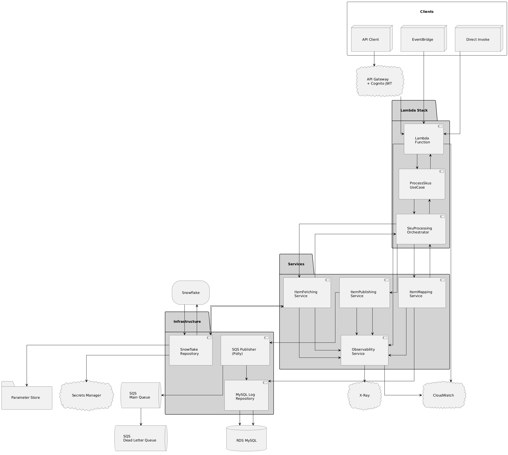

# ItemMaster

A serverless .NET 8 application built using Clean Architecture principles, designed to process SKU (Stock Keeping Unit)
data through AWS Lambda. The solution integrates with Snowflake for data retrieval and AWS SQS for message publishing.

## Table of Contents

- [Architecture Overview](#architecture-overview)
- [Key Features](#key-features)
- [Project Structure](#project-structure)
- [AWS Infrastructure](#aws-infrastructure)
- [Data Flow & Processing](#data-flow--processing)
- [Error Handling & Resilience](#error-handling--resilience)
- [Lambda Initialization](#lambda-initialization)
- [AWS Configuration Settings](#aws-configuration-settings)
- [Getting Started](#getting-started)
- [Running & Testing](#running--testing)
- [Deployment](#deployment)
- [Credentials & Access](#credentials--access)

---

## Architecture Overview

### Clean Architecture Layers


The ItemMaster solution follows Clean Architecture with clear separation of concerns across multiple layers:

```
ItemMaster/
├── ItemMaster.Lambda/           # AWS Lambda entry point
├── ItemMaster.Application/      # Application/Use Case layer
├── ItemMaster.Domain/           # Domain entities
├── ItemMaster.Infrastructure/   # External integrations
├── ItemMaster.Shared/          # Cross-cutting concerns
├── ItemMaster.Contracts/       # DTOs and contracts
└── ItemMaster.Lambda.Tests/    # Unit tests
```

**Design Principles:**

- **Dependency Inversion**: Higher-level layers depend only on abstractions
- **Single Responsibility**: Each layer has a clear, focused purpose
- **Separation of Concerns**: Business logic isolated from infrastructure
- **Testability**: In-memory implementations for all external dependencies

### Layer Descriptions

#### 1. Domain Layer (`ItemMaster.Domain`)

- Core business entities (`Item`)
- No dependencies on other layers
- Pure C# objects (POCOs)

#### 2. Application Layer (`ItemMaster.Application`)

- Use cases (`ProcessSkusUseCase`)
- Business workflows and orchestration
- Depends only on Domain and abstractions

#### 3. Infrastructure Layer (`ItemMaster.Infrastructure`)

- External service implementations:
    - `SnowflakeRepository` - RSA-authenticated data access
    - `SqsItemPublisher` - Message publishing with circuit breaker
    - `MySqlItemMasterLogRepository` - Audit logging
- Resilience patterns (Polly)
- EF Core configurations

#### 4. Lambda Layer (`ItemMaster.Lambda`)

- AWS Lambda handler
- Request source detection (API Gateway, EventBridge, Direct)
- Dependency injection container setup
- Configuration loading (appsettings, environment variables, Parameter Store)

#### 5. Shared Layer (`ItemMaster.Shared`)

- Common abstractions and interfaces
- Result pattern implementation
- Clock abstraction for testability

---

## 🎯 Key Features

- **Clean Architecture**: Clear separation of concerns with dependency inversion
- **Serverless**: AWS Lambda with .NET 8 runtime and ARM64 architecture
- **Multi-Source Requests**: Supports API Gateway (authenticated) and EventBridge triggers
- **RSA Key-Pair Authentication**: Secure Snowflake connection without passwords
- **Resilience Patterns**: Circuit breaker, retry policies, and partial batch retry logic
- **Observability**: Comprehensive logging (Serilog), CloudWatch metrics, and X-Ray distributed tracing (disable for
  cost savings)
- **Configuration Management**: Multi-source configuration (appsettings, environment variables, Parameter Store)
- **Security**: AWS Cognito JWT authentication, IAM roles, encrypted secrets (KMS)
- **CI/CD**: GitHub Actions automated deployment pipeline
- **Partial Batch Retry**: Only retries failed messages, not entire batches

---

## 🌐 AWS Infrastructure

### System Architecture


The complete AWS infrastructure includes:

- **API Gateway**: REST API with Cognito JWT authentication, rate limiting (1 req/sec, 1 burst)
- **AWS Cognito**: User Pool for authentication (Access token: 1hr, Refresh token: 1 day)
- **EventBridge**: Scheduled rules for batch processing (daily at 2:00 AM UTC)
- **Lambda Function**: Serverless compute with ARM64, .NET 8, 512MB, 60s timeout, No VPC (NAT cost savings)
- **IAM Roles**: Least privilege access for Lambda and other services
- **SQS Queue**: Main queue with 4-day retention, 60s visibility timeout, 10 max receive count
- **Dead Letter Queue (DLQ)**: Captures failed messages after 10 attempts
- **Snowflake Integration**: RSA key-pair authentication (no password required)
- **Parameter Store**: Encrypted configuration (RSA keys, connection strings)
- **Secrets Manager**: Database credentials with automatic rotation
- **CloudWatch**: Logs (7-day retention) and custom metrics
- **X-Ray**: Distributed tracing (PassThrough mode)
- **RDS MySQL**: Audit trail database (db.t4g.micro ARM-based)

### Infrastructure Configuration Details


**All infrastructure components are fully deployed and operational.**

---

## 📊 Data Flow & Processing

### Processing Workflow



The data flow demonstrates three request sources:

#### 1. API Gateway Path (Authenticated)

- Client sends POST request to `/process-skus` with JWT token
- API Gateway validates token with Cognito User Pool
- Rate limiting applied (1 req/sec)
- SKUs extracted from request body
- Lambda processes and returns response

#### 2. EventBridge Path (Scheduled/Event-Driven)

- EventBridge triggers Lambda on schedule (daily at 2:00 AM UTC)
- Lambda detects EventBridge source via header
- Automatically retrieves top 100 items from Snowflake
- Processes without specific SKU input

#### 3. Direct Lambda Invocation (Current Testing Method)

- Direct invocation for testing and development
- Bypasses API Gateway authentication
- Useful for CI/CD health checks

### SKU Processing Workflow


**Complete processing flow:**

1. **Request Source Detection**: `RequestSourceDetector` identifies trigger source
2. **Authentication Validation**: JWT token verification (API Gateway only)
3. **Snowflake Query**: RSA-authenticated data retrieval
4. **Batch Processing**: Split items into batches of 10
5. **Circuit Breaker Check**: Protect against cascading failures
6. **SQS Publishing**: Send messages with retry logic
7. **Partial Batch Retry**: Only retry failed messages (not entire batch)
8. **Dead Letter Queue**: Capture permanently failed messages after 10 attempts
9. **Audit Logging**: MySQL database logs all operations
10. **Observability**: CloudWatch metrics and X-Ray traces

**Key Feature - Partial Batch Retry:**

- If 7 out of 10 messages succeed, only 3 failed messages are retried
- Successful messages logged immediately and never retried
- Exponential backoff: 1s → 2s → 4s
- After 3 retries, failed messages move to DLQ

---

## ⚡ Error Handling & Resilience


### Resilience Patterns Implemented

#### 1. Circuit Breaker (Polly)

- **Failure Threshold**: 5 failures (50%)
- **Break Duration**: 30 seconds
- **Sampling Duration**: 60 seconds
- **Minimum Throughput**: 3 requests
- **Behavior**: Fast-fail when circuit opens, prevents cascading failures

#### 2. Retry Policy

- **Max Retries**: 3 attempts
- **Base Delay**: 1000ms (1 second)
- **Backoff Multiplier**: 2.0x
- **Pattern**: Exponential backoff (1s → 2s → 4s)
- **Scope**: Per-message retry, not per-batch

#### 3. Dead Letter Queue

- **Retention**: 4 days (345,600 seconds)
- **Max Receive Count**: 10 attempts (SQS-level)
- **Purpose**: Capture permanently failed messages
- **Monitoring**: CloudWatch alarms on DLQ message count

#### 4. Partial Batch Retry Logic

```csharp
// Example: 10 messages sent, 7 succeed, 3 fail
Batch: [M1, M2, M3, M4, M5, M6, M7, M8, M9, M10]
Result: [✓, ✓, ✓, ✓, ✓, ✓, ✓, ✗, ✗, ✗]

// Only retry failed messages
Retry: [M8, M9, M10] with exponential backoff
// Successful messages already logged, never retried
```

---

## 🏃‍♂️ Lambda Initialization


### Cold Start Process

The Lambda cold start initialization includes:

1. **AWS X-Ray Handler Registration**: PassThrough mode for distributed tracing
2. **Test Mode Check**: Environment variable `ITEMMASTER_TEST_MODE` for local testing
3. **Configuration Loading**:
    - appsettings.json (base configuration)
    - Environment variables (DOTNET_ENVIRONMENT, CONFIG_BASE, REGION, SSM_RSA_PATH)
    - Parameter Store (`/im/development/*`)
4. **RSA Key Loading**: Snowflake private key from Parameter Store (SecureString with KMS)
5. **Service Container Setup**: Dependency injection with all services registered
6. **AWS Services Registration**: SQS, CloudWatch, Secrets Manager, X-Ray
7. **Database Configuration**: Entity Framework Core with MySQL
8. **Observability Setup**: Serilog structured logging, CloudWatch metrics

### Test Mode (In-Memory)

When `ITEMMASTER_TEST_MODE=true`:

- `InMemorySnowflakeRepository` (mock data)
- `InMemoryItemPublisher` (no SQS required)
- `InMemoryItemMasterLogRepository` (no MySQL required)
- EF Core in-memory database
- No AWS service dependencies

---

## 🔧 AWS Configuration Settings

### Lambda Function Configuration

| Setting               | Value                                                            | Description                                   |
|-----------------------|------------------------------------------------------------------|-----------------------------------------------|
| **Function Name**     | `im-dev-lambda-item-master`                                      | Lambda function identifier                    |
| **Runtime**           | .NET 8 (dotnet8)                                                 | Latest .NET LTS release                       |
| **Architecture**      | ARM64                                                            | 20% cost savings vs x64                       |
| **Memory**            | 512 MB                                                           | Right-sized for workload                      |
| **Timeout**           | 60 seconds                                                       | Maximum execution time                        |
| **Handler**           | `ItemMaster.Lambda::ItemMaster.Lambda.Function::FunctionHandler` | Entry point                                   |
| **VPC**               | None                                                             | Direct internet access (no NAT Gateway costs) |
| **Ephemeral Storage** | 512 MB                                                           | Default Lambda storage                        |
| **X-Ray Tracing**     | PassThrough                                                      | Distributed tracing enabled                   |

### SQS Queue Configuration

#### Main Queue: `im-dev-itemmaster-queue`

| Setting                | Value                 | Description                   |
|------------------------|-----------------------|-------------------------------|
| **Message Retention**  | **4 days (345,600s)** | How long messages are kept    |
| **Visibility Timeout** | **60 seconds**        | Matches Lambda timeout        |
| **Max Receive Count**  | **10 attempts**       | After 10 failures → DLQ       |
| **Long Polling**       | **10 seconds**        | Reduces empty receive charges |
| **Encryption**         | SQS-Managed SSE       | Server-side encryption        |
| **Batch Size (Code)**  | 10 messages           | Messages per SendMessageBatch |

#### Dead Letter Queue: `im-dev-itemmaster-dlq`

| Setting                | Value                 | Description              |
|------------------------|-----------------------|--------------------------|
| **Message Retention**  | **4 days (345,600s)** | Failed message retention |
| **Visibility Timeout** | **30 seconds**        | Lower for inspection     |
| **Encryption**         | SQS-Managed SSE       | Server-side encryption   |

### CloudWatch Logs Configuration

| Log Group                                      | Retention  | Description               |
|------------------------------------------------|------------|---------------------------|
| `/aws/lambda/im-dev-lambda-item-master`        | **7 days** | Main Lambda function logs |
| `/aws/lambda/im-dev-lambda-item-master-api-gw` | **3 days** | API Gateway Lambda logs   |

**Custom Metrics:**

- `ItemsProcessed` - Number of items processed per invocation
- `ItemsPublished` - Number of items successfully published to SQS
- `ProcessingDuration` - Total processing time
- `SnowflakeQueryDuration` - Snowflake query execution time
- `SqsPublishDuration` - SQS publishing time

### AWS Cognito Configuration

| Token Type        | Expiration | Description               |
|-------------------|------------|---------------------------|
| **ID Token**      | **1 hour** | User identity information |
| **Access Token**  | **1 hour** | API Gateway authorization |
| **Refresh Token** | **1 day**  | Obtain new access tokens  |

**Security:**

- Token Type: RS256 (RSA Signature with SHA-256)
- Password Policy: Min 8 chars, complexity required
- MFA: Optional (TOTP)

### API Gateway Configuration

| Setting           | Value             | Description                    |
|-------------------|-------------------|--------------------------------|
| **Rate Limit**    | **1 req/sec**     | Maximum sustained request rate |
| **Burst Limit**   | **1 requests**    | Maximum concurrent requests    |
| **Authorization** | Cognito User Pool | JWT Bearer token               |

### Parameter Store Configuration

**Base Path**: `/im/development/`

#### Logging Configuration

- `log_level` (String) - Application log level (Debug, Information, Warning, Error)

#### MySQL Database Configuration

- `mysql/db` (String) - MySQL database name
- `mysql/host` (String) - MySQL host endpoint
- `mysql/port` (String) - MySQL port number (default: 3306)
- `mysql/secret_arn` (String) - ARN of the Secrets Manager secret containing MySQL credentials
- `mysql/ssl_mode` (String) - SSL mode for MySQL connection (Required, Preferred, None)

#### Snowflake Configuration

- `snowflake/account` (String) - Snowflake account identifier
- `snowflake/database` (String) - Snowflake database name
- `snowflake/role` (String) - Snowflake role for authentication
- `snowflake/schema` (String) - Snowflake schema name
- `snowflake/table` (String) - Snowflake table name
- `snowflake/user` (String) - Snowflake username
- `snowflake/warehouse` (String) - Snowflake warehouse name

#### SQS Configuration

- `sqs/url` (String) - SQS queue URL
- `sqs/max_retries` (String) - Maximum retry attempts (default: 3)
- `sqs/base_delay_ms` (String) - Base delay in milliseconds (default: 1000)
- `sqs/backoff_multiplier` (String) - Exponential backoff multiplier (default: 2.0)
- `sqs/batch_size` (String) - Batch size for message publishing (default: 10)

#### Circuit Breaker Configuration

- `sqs/circuit_breaker_failure_threshold` (String) - Number of failures before opening circuit (default: 5)
- `sqs/circuit_breaker_duration_of_break_seconds` (String) - Duration circuit stays open in seconds (default: 30)
- `sqs/circuit_breaker_sampling_duration_seconds` (String) - Sampling window duration in seconds (default: 60)
- `sqs/circuit_breaker_minimum_throughput` (String) - Minimum throughput before circuit breaker activates (default: 3)

**Note:** All parameters are stored as Standard String type.

### Snowflake RSA Authentication

**Security Highlight: RSA Key-Pair Authentication**

- **Method**: RSA Key-Pair (no password required)
- **Algorithm**: RSA 2048-bit
- **Format**: PEM (PKCS#8)
- **Private Key Storage**: AWS Parameter Store (SecureString with KMS encryption)
- **Public Key**: Registered in Snowflake service account
- **Connection**: HTTPS/TLS for all communications
- **Benefits**: More secure than password, no credential rotation needed

### EventBridge Configuration

| Setting       | Value                 | Description                        |
|---------------|-----------------------|------------------------------------|
| **Rule Name** | `im-dev-daily-top100` | Scheduled rule identifier          |
| **Schedule**  | `cron(0 2 * * ? *)`   | Daily at 2:00 AM UTC (9:00 AM VNT) |
| **Target**    | Lambda function       | Triggers Lambda invocation         |

### RDS MySQL Configuration

| Setting            | Value              | Description              |
|--------------------|--------------------|--------------------------|
| **Instance ID**    | `im-dev-mysql`     | Database instance name   |
| **Engine**         | MySQL 8.0          | Database engine version  |
| **Instance Class** | db.t4g.micro (ARM) | Cost-effective ARM-based |
| **Storage**        | 20 GB SSD          | General Purpose storage  |
| **Port**           | 3306               | MySQL default port       |

---

## Getting Started

### Prerequisites

- **.NET 8 SDK** or later
- **AWS CLI** configured with appropriate permissions
- **GitHub Actions** access for CI/CD deployment

### Local Development Setup

1. **Clone the repository**
   ```bash
   git clone <repository-url>
   cd ItemMaster
   ```

2. **Restore NuGet packages**
   ```bash
   dotnet restore
   ```

3. **Build the solution**
   ```bash
   dotnet build
   ```

4. **Set up environment variables** (for local testing)
   ```bash
   export ITEMMASTER_TEST_MODE=true
   export DOTNET_ENVIRONMENT=development
   export CONFIG_BASE="/im"
   export REGION="ap-southeast-1"
   export SSM_RSA_PATH="/im/development/rsa_key"
   ```

---

## Running & Testing

### Unit Tests

```bash
# Run all tests
dotnet test

# Run tests with coverage
dotnet test --collect:"XPlat Code Coverage"

# Run specific test project
dotnet test ItemMaster.Lambda/test/ItemMaster.Lambda.Tests/
```

### Local Lambda Testing

#### 1. Install AWS Lambda Tools

```bash
dotnet tool install -g Amazon.Lambda.Tools
```

#### 2. Test with Direct Invocation (Simple)

```bash
cd ItemMaster.Lambda/src/ItemMaster.Lambda/

# Test with specific SKUs
dotnet lambda invoke-function FunctionHandler --payload '{"body":"{\"skus\":[\"TEST123\",\"TEST456\"]}"}'
```

#### 3. Test with API Gateway Payload

```bash
# Uses the apigw-process-skus.json file
dotnet lambda invoke-function FunctionHandler --payload @apigw-process-skus.json
```

#### 4. Test with EventBridge Payload (Top 100)

```bash
# Simulates EventBridge scheduled trigger
dotnet lambda invoke-function FunctionHandler --payload '{"source":"aws.events","detail":{"requestType":"top100"}}'
```

---

## Deployment

### CI/CD with GitHub Actions

The deployment is fully automated using GitHub Actions:

**Deployment Triggers:**

- Push to `main` branch → Auto-deploy
- Manual workflow dispatch
- Release tag creation

**GitHub Actions Workflow:**

1. Checkout code
2. Setup .NET 8 SDK (ARM64)
3. Restore NuGet packages
4. Build solution
5. Run unit tests
6. Package Lambda function (ZIP)
7. Deploy to AWS Lambda via AWS CLI
8. Run health check
9. Post-deployment validation

### Environment Promotion

- **Development**: Auto-deploy on push to `develop`
- **Staging**: Manual approval required
- **Production**: Manual approval + change request

---

## 🔐 Credentials & Access

### Where to Find Credentials

**All sensitive credentials and configuration details are provided in the Jira ticket comments section.** This includes:

- **AWS Account Access**: IAM user credentials or SSO login
- **Cognito Test Accounts**: Username, password, and client ID for testing
- **JWT Token Details**: How to obtain access tokens and refresh tokens (configured in Postman collection)
- **Token Expiration Times**: Access token (1 hour), Refresh token (1 day)
- **Snowflake Connection**: Account URL, username, database details
- **Snowflake RSA Keys**: Location of private key in Parameter Store
- **MySQL Credentials**: Secret ARN in Secrets Manager
- **API Gateway URL**: Endpoint URL and stage name
- **SQS Queue URLs**: Main queue and DLQ URLs

---
